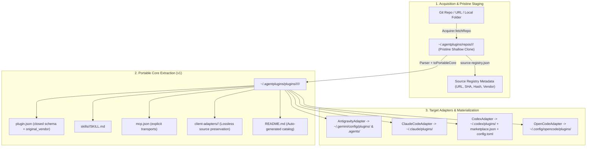

# AgentPlugins Master Project Map & Architecture Guide

> **Welcome!** This document provides the complete, end-to-end architecture, directory layout, execution pipelines, and adapter protocols for the `agentpm` / `plugins` project. Any AI agent or developer reading this document will understand the entire project in one go.

---

## 1. High-Level Vision & Core Purpose

`plugins` (bin alias: `agentpm`) is the **Universal AI Agent Plugin & Skill Manager**. It allows developers and teams to download, convert, manage, and materialize portable plugins across all major AI coding agents:
1. **Google Antigravity / Gemini CLI** (`.agents/` workspace & `~/.gemini/config/plugins/` global)
2. **Claude Code** (`.agents/plugins/` or `.claude/plugins/` workspace & `~/.claude/plugins/` global)
3. **OpenAI Codex** (`.agents/plugins/` workspace & `~/.codex/plugins/` global + `marketplace.json` + `config.toml`)
4. **OpenCode AI** (`.agents/plugins/` workspace & `~/.config/opencode/plugins/` global)

---

## 2. The Conversion & Storage Pipeline



---

## 3. Directory Layout & Key Files Map

```
/
├── src/                                  # TypeScript CLI Core (ESM, strict NodeNext)
│   ├── index.ts                          # Commander.js CLI entrypoint (binary: plugins / agentpm)
│   ├── adapters/                         # Host agent lifecycle + conversion adapters
│   │   ├── base.ts                       # AgentAdapter interface
│   │   ├── antigravity.ts                # Google Antigravity adapter (.agents/, ~/.gemini/config/)
│   │   ├── claudecode.ts                 # Claude Code adapter (~/.claude/plugins/)
│   │   ├── codex.ts                      # OpenAI Codex adapter (~/.codex/plugins/, marketplace, toml)
│   │   ├── opencode.ts                   # OpenCode adapter (~/.config/opencode/plugins/)
│   │   ├── convert-writer.ts             # Native per-target emission shared by adapters
│   │   └── index.ts                      # Adapter registry (discovery + lifecycle dispatch)
│   ├── commands/                         # CLI command implementations
│   │   ├── add.ts                        # `plugins add <pkg>` (download, convert, enable; alias install)
│   │   ├── enable.ts                     # `plugins enable <pkg>` (materialize symlink/copy)
│   │   ├── disable.ts                    # `plugins disable <pkg>` (dematerialize symlink)
│   │   ├── uninstall.ts                  # `plugins remove <pkg>` (dematerialize + purge store)
│   │   ├── list.ts                       # `plugins list` (workspace materializations or global store)
│   │   ├── info.ts                       # `plugins info <pkg>` (manifest & capability inspect)
│   │   ├── convert.ts                    # `plugins convert <src> -t <target>` (format converter)
│   │   ├── init.ts                       # `plugins init [name]` (scaffold portable v1 plugin)
│   │   ├── use.ts                        # `plugins use <pkg>` (prompt runner without install)
│   │   ├── find.ts                       # `plugins find [query]` (GitHub search for plugins)
│   │   ├── update.ts                     # `plugins update [plugins...]` (re-download + reconvert)
│   │   ├── inspect.ts                    # `plugins inspect <source>` (deep-parse into IR summary)
│   │   ├── docs.ts                       # `plugins docs [provider]` (capability matrix / spec docs)
│   │   ├── doctor.ts                     # `plugins doctor` (health checks, validate manifests)
│   │   └── providers.ts                  # `plugins providers` (inspect provider dirs on disk)
│   ├── core/                             # Storage, config, and materialization engines
│   │   ├── acquirer.ts                   # Git clone & local path acquisition + security checks
│   │   ├── config.ts                     # Injectable store roots (~/.agentplugins/ + ~/.cache/agentpm)
│   │   ├── store.ts                      # GlobalStore (repos/, plugins/, registry management)
│   │   ├── materialization.ts            # Symlink creation, copy mode, and dematerialization
│   │   ├── portable-writer.ts            # Emits portable v1 core + auto-generated README.md
│   │   ├── v1-manifest.ts                # Manifest validation & normalization
│   │   ├── manifest-validator.ts         # Multi-client manifest validation
│   │   ├── codex-validator.ts            # Native pure TypeScript Codex validator
│   │   ├── toml-builder.ts               # config.toml emission for Codex runtime activation
│   │   └── topology.ts                   # ProviderTopology seam for provider discovery & inspection
│   ├── ir/                               # Intermediate Representation (IR) types & mappers
│   │   ├── types.ts                      # PluginIR (9 types) & PortableCoreIR (narrowed seam)
│   │   ├── to-portable-core.ts           # ADR 0013 single narrowing seam
│   │   ├── skill-format.ts               # SKILL.md serializing & frontmatter formatting
│   │   └── native-hooks.ts               # Hook serialization
│   └── parser/                           # Source plugin parsers (Claude Code, skills, MCP)
│
├── resource/                             # Agent Knowledge Base & Reference Schemas
│   ├── README.md                         # Index of agent topologies and specs
│   ├── codex.md                          # Codex validation schema, marketplace.json, config.toml
│   ├── claude-code.md                    # Claude Code manifest, 31 hook lifecycle events
│   ├── antigravity.md                    # Antigravity .agents/ workspace and named hooks
│   └── opencode.md                       # OpenCode opencode.json and TypeScript plugin SDK
│
├── docs/                                 # Documentation & ADRs
│   ├── PROJECT_MAP.md                    # THIS FILE: Master context & architecture guide
│   ├── Global-Plugin-Failure-Modes-and-Solutions.md # Deep troubleshooting & failure modes
│   ├── Cross-Agent Plugin Manager Research.md       # Full ecosystem comparative research
│   └── adr/                              # Architectural Decision Records (0001 - 0015)
│
├── test/                                 # Native Node.js test suite (node:test via tsx)
│   ├── adapters.test.ts                  # Adapter unit tests & symlink lifecycles
│   ├── codex-validator.test.ts           # Codex schema validation tests
│   ├── materialization.test.ts           # Symlink & copy mode materialization tests
│   ├── portable.test.ts                  # Portable v1 core emission tests
│   └── store.test.ts                     # GlobalStore and security tests
│
├── plugin.json                           # Portable v1 manifest dogfooding our own format
└── AGENTS.md                             # Repository rules, security constraints & CLI guide
```

---

## 4. Global Store Hierarchy (`~/.agentplugins/`)

```
~/.agentplugins/
├── repos/                                # 1. Pristine Shallow Git Clones
│   └── <namespace>/<plugin>/             #    Contains full upstream repo (tests, docs, build)
│
├── plugins/                              # 2. Clean Extracted Portable Bundles
│   └── <vendor>/<namespace>/<plugin>/<version>/
│       ├── plugin.json                   #    Closed-schema v1 manifest + original_vendor tag
│       ├── skills/<name>/SKILL.md        #    Extracted portable skills
│       ├── mcp.json                      #    Portable MCP servers with explicit transports
│       ├── client-adapters/<client>/     #    Preserved original source files whole
│       └── README.md                     #    Auto-generated plugin catalog & enable guide
│
├── adapted/                              # 3. Target-Specific Staged Conversions
│   ├── antigravity/                      #    Native Antigravity layout
│   ├── claude-code/                      #    Native Claude Code layout
│   ├── codex/                            #    Native Codex layout (with interface block)
│   ├── opencode/                         #    Native OpenCode layout
│   └── pi/                               #    Native Pi extension layout (with index.ts wrapper)
│
└── source-registry.json                  # 4. Central Provenance Registry
```

---

## 5. Host Provider Target Path Matrix (Real-World Architecture)

| Agent Provider | Global Plugin Destination | Primary Workspace Target | Root Manifest |
|---|---|---|---|
| **Google Antigravity** | `~/.gemini/config/plugins/<name>` | `.agents/plugins/<name>` | `plugin.json` (`$schema: .../v1/plugin.json`) |
| **Claude Code** | `~/.claude/plugins/` | `.claude/plugins/<name>` | `.claude-plugin/plugin.json` |
| **OpenCode AI** | `~/.config/opencode/plugins/<name>` | `.opencode/plugins/<name>` | `opencode.json` (`$schema: .../config.json`) |
| **OpenAI Codex** | `~/.codex/plugins/cache/personal/<name>` | `.agents/plugins/<name>` | `.codex-plugin/plugin.json` |
| **Pi Coding Agent** | `~/.pi/agent/extensions/<name>` | `.pi/extensions/<name>` | `trust.json` + `index.ts` |

---

## 6. Architecture Decision Records (ADRs)

- [ADR 0021: Workspace Lockfile and File Tracking](file:///Users/rayhanislamshuvro/Developer/projects/agentpm/docs/adr/0021-workspace-lockfile-and-file-tracking.md)
- [ADR 0022: Universal Tool Mapping and Unknown Tool Pass-Through](file:///Users/rayhanislamshuvro/Developer/projects/agentpm/docs/adr/0022-universal-tool-mapping-and-unknown-tool-pass-through.md)
- [ADR 0023: Command/Workflow Conversion and 12k Limit Fallback](file:///Users/rayhanislamshuvro/Developer/projects/agentpm/docs/adr/0023-command-workflow-conversion-and-12k-limit-fallback.md)
- [ADR 0024: MCP Path Rewriting and Absolute Expansion](file:///Users/rayhanislamshuvro/Developer/projects/agentpm/docs/adr/0024-mcp-path-rewriting-and-absolute-expansion.md)
- [ADR 0025: Pi Agent Adapter TypeScript Extension Synthesis](file:///Users/rayhanislamshuvro/Developer/projects/agentpm/docs/adr/0025-pi-agent-adapter-typescript-extension-synthesis.md)
- [ADR 0026: Multi-Agent Runtime Topologies and Materialization Contract](file:///Users/rayhanislamshuvro/Developer/projects/agentpm/docs/adr/0026-multi-agent-runtime-topologies-and-materialization-contract.md)

---

## 6. Codex-Specific Protocol Requirements

1. **Manifest Schema (`.codex-plugin/plugin.json`)**:
   - Must contain the `interface` object (`displayName`, `shortDescription`, `longDescription`, `developerName`, `category`, `capabilities: ['Interactive', 'Write']`, `defaultPrompt`).
   - Root `"hooks"` key is strictly disallowed.
   - Validated natively in TypeScript via `src/core/codex-validator.ts`.
2. **Personal Marketplace (`~/.agents/plugins/marketplace.json`)**:
   - Automatically registered on `enable` with:
     ```json
     {
       "name": "superpowers",
       "source": { "source": "local", "path": "./plugins/superpowers" },
       "policy": { "installation": "AVAILABLE", "authentication": "ON_INSTALL" },
       "category": "Coding"
     }
     ```
3. **Runtime Activation (`~/.codex/config.toml`)**:
   - Automatically appends `[plugins."<name>@personal"] enabled = true`.

---

## 7. Development & Verification Commands

```bash
# Compile TypeScript
npm run build

# Run full test suite (all 63 tests across 14 suites)
npm test

# Test CLI commands
npx tsx src/index.ts list
npx tsx src/index.ts add https://github.com/obra/superpowers/tree/main -g --force
npx tsx src/index.ts remove superpowers -g
```
